# BabelWiki
## 项目简介：
山东大学计算机学院数据智能班数据库课程大作业(因老师要求，未用orm，纯手写sql，django框架)
## 项目内容：
项目包含完善的用户端与管理端，用户端包含主页，个人中心，干员主页，敌人档案，关卡一览，卡池一览，干员档案，评论区，道具材料，模拟抽卡，抽卡记录，抽卡分析等模块；管理端包含工作记录，项目分组，提交审批等模块
## 项目展示：
### 主页
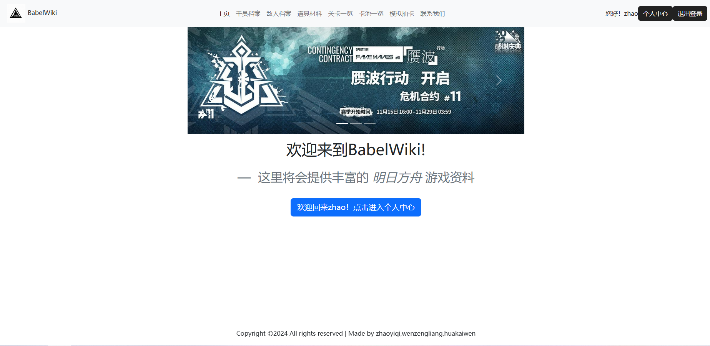
### 个人中心
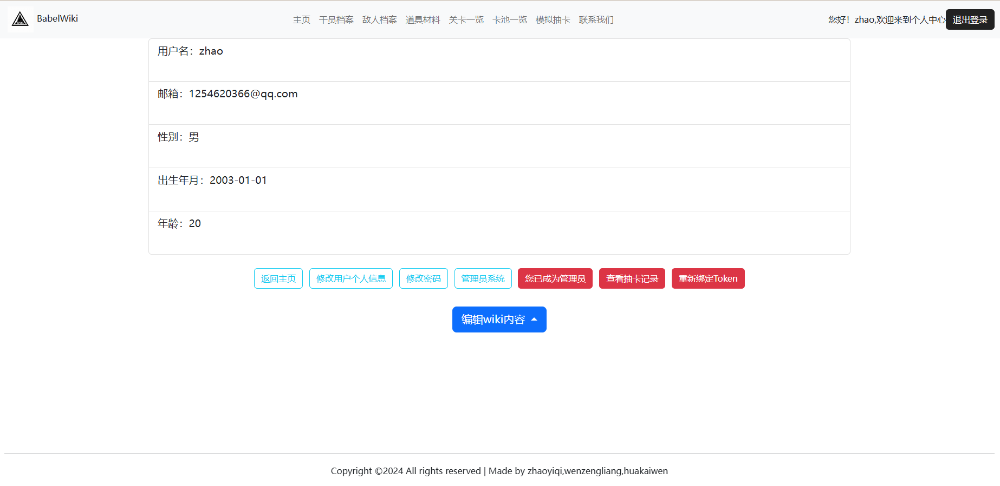
### 干员主页
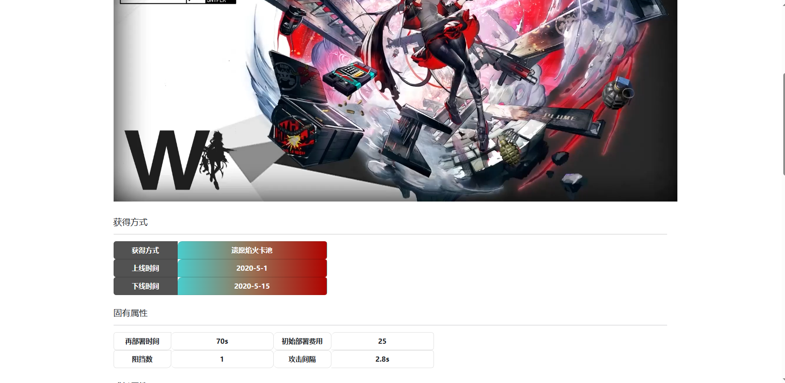
### 敌人档案
与干员主页类似
### 关卡一览
与干员主页类似
### 卡池一览
与干员主页类似
### 干员档案
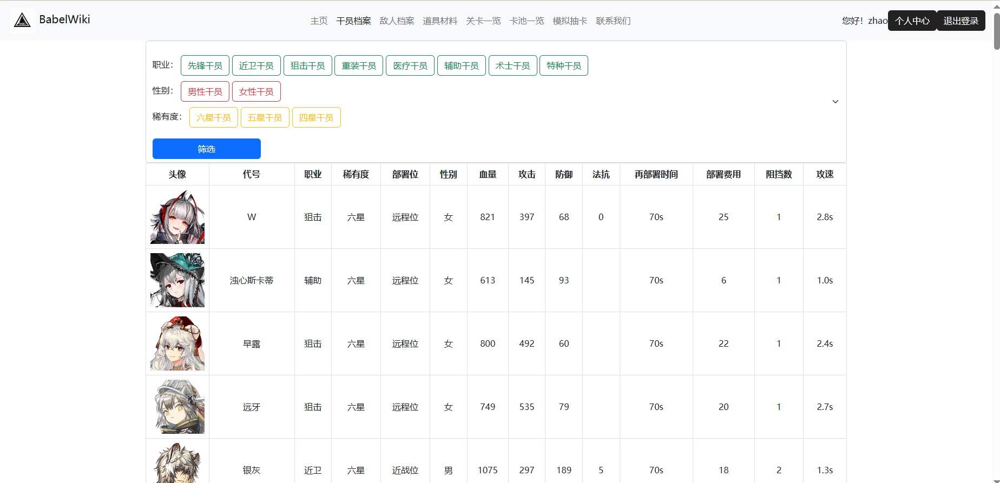
### 评论区
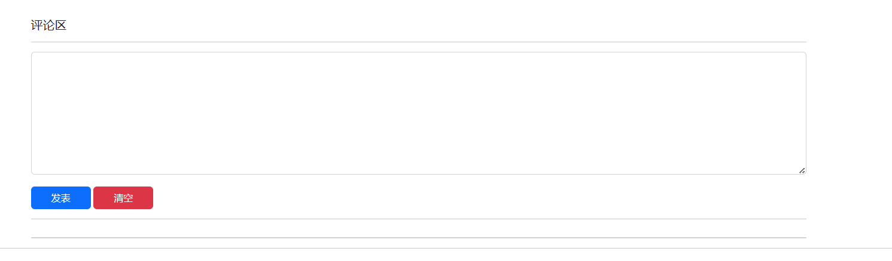
### 道具材料
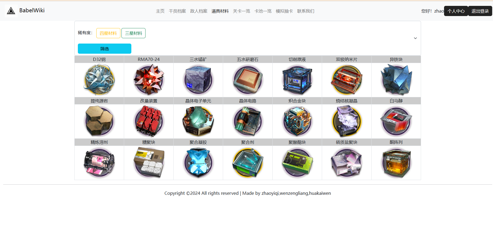
### 模拟抽卡
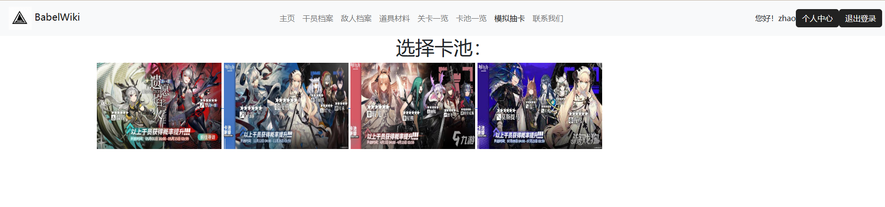
### 抽卡
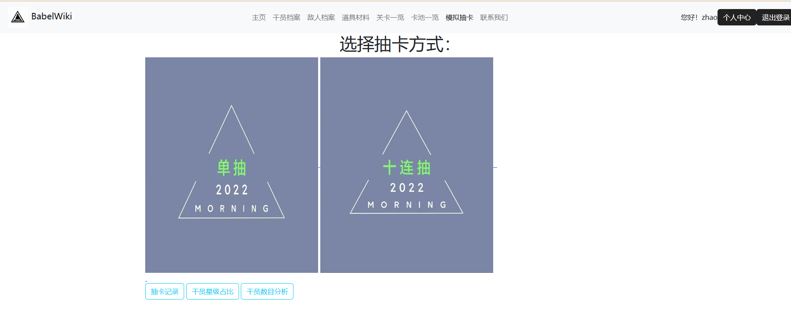
### 十连抽
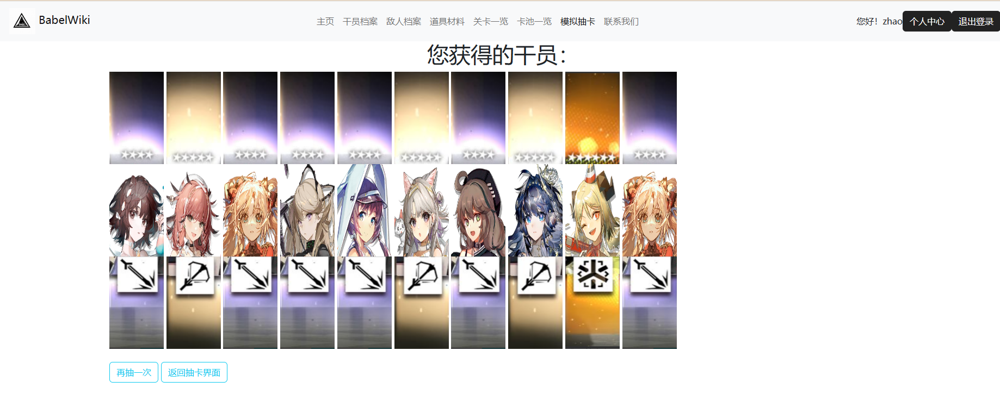
### 抽卡记录
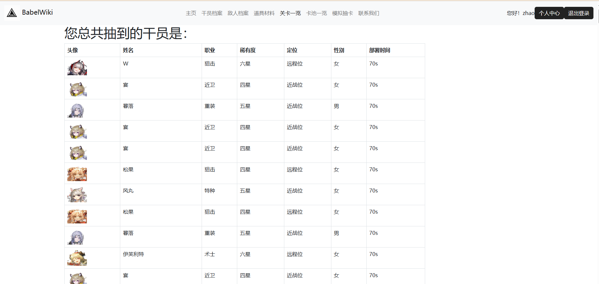
### 抽卡分析
简单的可视化统计分析
### 工作记录
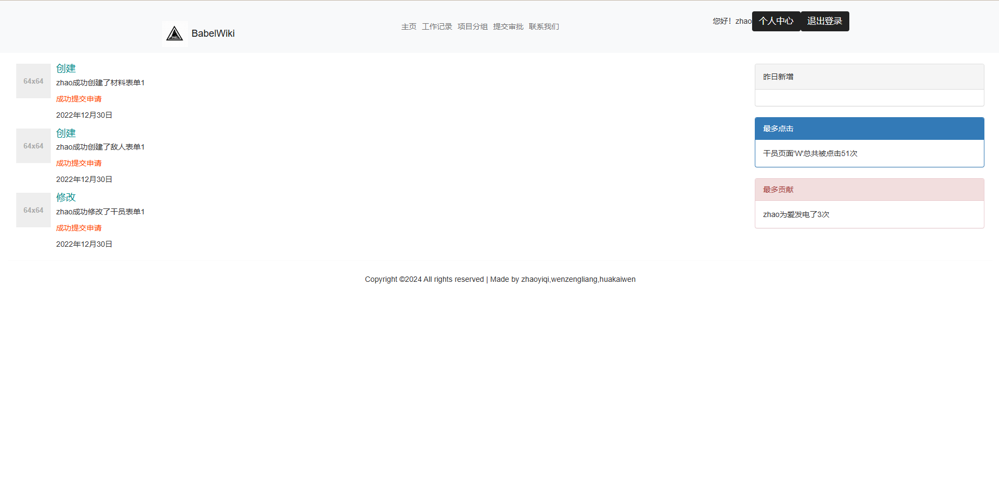
### 项目分组
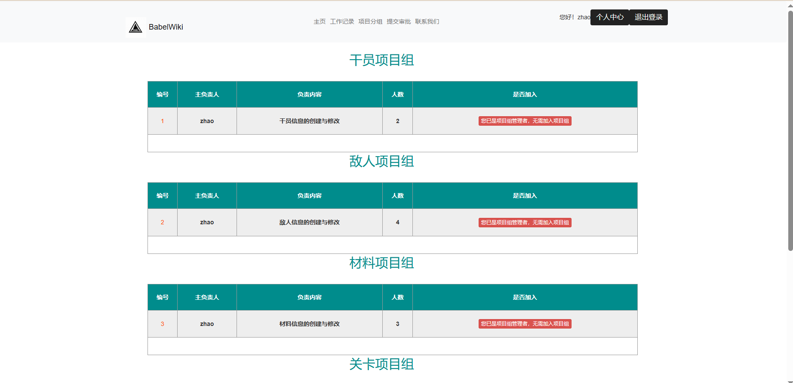
### 提交审批
暂有一点小问题，懒得debug了，以前是能用的
